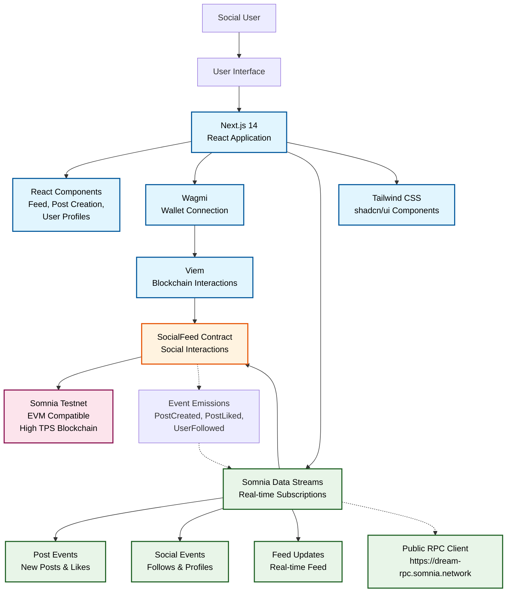

# Reactive Social Feed - Somnia Data Streams Hackathon Submission

A real-time social media platform built on Somnia Testnet, showcasing the power of Somnia Data Streams (SDS) for instant, reactive on-chain social interactions.

## Features

- **Real-Time Social Feed**: Post, like, and follow with instant updates
- **Live Social Interactions**: Real-time updates using Somnia Data Streams (SDS)
- **On-Chain Social Data**: All interactions stored immutably on blockchain
- **User Profiles**: Create and update profiles with username and bio
- **Web3 Integration**: Connect wallet, interact with Somnia Testnet

## Somnia Data Streams Integration

This project leverages SDS to transform on-chain social data into live, reactive streams:

### Real-Time Social Feed Updates
- **Event Subscriptions**: Subscribes to `PostCreated`, `PostLiked`, `UserFollowed` events from the SocialFeed contract
- **Schema Definitions**: Uses structured schemas for efficient data streaming:
  ```
  uint256 postId, address author, string content, uint256 timestamp
  uint256 postId, address liker, uint256 totalLikes
  address follower, address followed
  ```
- **Reactive UI**: Feed updates instantly when new posts are created or interactions occur, without polling
- **Fallback Mechanism**: Gracefully falls back to 5-second polling if SDS subscription fails

### Benefits Over Traditional Approaches
- **Instant Updates**: No delays between on-chain social events and UI updates
- **Reduced Load**: Eliminates constant API calls and polling overhead
- **Scalable**: Handles high-frequency social interactions efficiently
- **Real-Time UX**: Provides live, responsive social media experience

### SDS Implementation Details
```typescript
const subscription = await sdsClient.subscribe({
  eventContractSources: [CONTRACT_ADDRESS],
  topicOverrides: [], // Social event topics
  ethCalls: [{
    to: CONTRACT_ADDRESS,
    data: '0x...' // getPostCount function call
  }],
  onData: (data) => {
    refetchPosts() // Update feed on new posts
  },
  onError: (error) => {
    console.error('SDS subscription error:', error)
  },
  onlyPushChanges: true
})
```

## Architecture

### System Architecture Diagram



### Architecture Overview

- **Frontend Layer**: Next.js 14 with TypeScript provides the web application framework, React components manage social UI state
- **Web3 Integration**: Wagmi manages wallet connections and user authentication, Viem handles low-level blockchain interactions
- **Data Streaming**: Somnia Data Streams (SDS) enables real-time event subscriptions for post creation, likes, follows, and profile updates
- **Smart Contracts**: Solidity contract deployed on Somnia Testnet handles social interactions, posts, likes, follows, and profiles
- **Blockchain**: Somnia Testnet provides high-performance EVM-compatible infrastructure with sub-second finality and 1M+ TPS capacity

### Data Flow

1. **Social Actions**: Users create posts, like content, follow others via UI
2. **On-Chain Submission**: Social interactions submitted to SocialFeed contract via Web3 calls
3. **Event Emission**: Contract emits `PostCreated`, `PostLiked`, `UserFollowed` events
4. **SDS Streaming**: Events captured by SDS and streamed to subscribed clients
5. **Real-Time UI**: Frontend components update instantly with new social data
6. **Live Feed**: Social feed shows real-time updates from all users

## Getting Started

### Prerequisites
- Node.js 18+
- npm or yarn
- MetaMask or compatible Web3 wallet

### Installation

1. Clone the repository:
```bash
git clone <your-repo-url>
cd reactive-social-feed
```

2. Install dependencies:
```bash
npm install
```

3. Start the development server:
```bash
npm run dev
```

4. Open [http://localhost:3000](http://localhost:3000)

### Smart Contract Deployment

The SocialFeed contract is deployed on Somnia Testnet at: `0xAA8Bd99ACb7c3ad8b81C12bC249D6dD44Bed2DFF`
To deploy:
```bash
cd contracts
forge install
forge script script/Deploy.s.sol --rpc-url https://dream-rpc.somnia.network --broadcast --verify
```

## 📱 How to Use

1. Connect your Web3 wallet
2. Create a post using the post creation form
3. Like posts from other users
4. Follow interesting users
5. Update your profile with username and bio
6. Watch the feed update in real-time as others interact

## Contract Details

- **Network**: Somnia Testnet
- **Address**: `0x...` (to be updated after deployment)
- **ABI**: See `src/contracts/SocialFeedABI.ts`

### Key Functions
- `createPost(string content)`: Create a new post
- `likePost(uint256 postId)`: Like a post
- `followUser(address userToFollow)`: Follow a user
- `updateProfile(string username, string bio)`: Update user profile
- `getPosts(uint256 offset, uint256 limit)`: Get posts with pagination

## Environment Variables

Create a `.env.local` file:
```
NEXT_PUBLIC_CONTRACT_ADDRESS=0x...
```

## Hackathon Criteria Met

- ✅ **Technical Excellence**: Well-implemented SDS integration with proper error handling and fallbacks
- ✅ **Real-Time UX**: Instant updates for all social interactions using SDS streams
- ✅ **Somnia Integration**: Deployed on Somnia Testnet with full SDS functionality
- ✅ **Potential Impact**: Demonstrates real-time social platform capabilities with blockchain immutability

## Future Enhancements

- Direct messaging with SDS-powered real-time chat
- Content moderation and community features
- Advanced social analytics and trending posts
- Mobile app with push notifications via SDS

## Contributing

This project is part of the Somnia Data Streams Mini Hackathon. Contributions welcome!

## License

MIT License - see LICENSE file for details.
